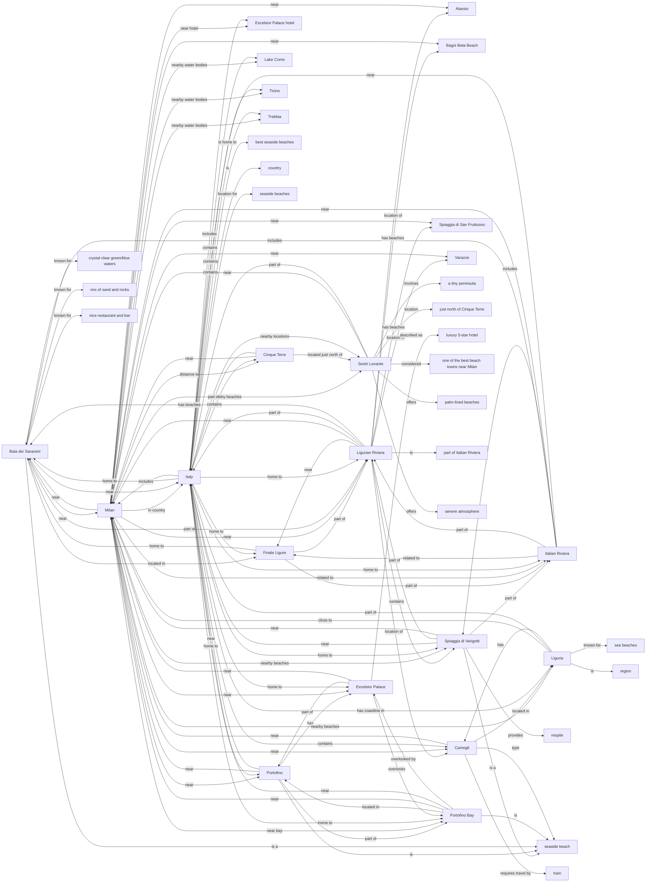

**DeepDive**
================

A command-line tool for conducting in-depth research on a topic or question, leveraging the power of web searches and AI-driven insights.

**Overview**
------------

DeepDive is designed to help users gain a deeper understanding of a subject by automatically running multiple web searches, aggregating information, and generating a comprehensive knowledge graph. This tool is perfect for researchers, students, and anyone looking to explore complex topics in a structured and efficient manner.

**Getting Started**
-------------------

### Installation

To install DeepDive, simply clone this repository and build the executable using the following command:
```bash
go build bin/single-search/single-search.go 
```
### Usage

Run DeepDive with the following command:
```bash
./single-search [options]
```
**Options**
------------

* `--engine-url`: Specify the LLM API endpoint (default: `http://localhost:7999/v1/chat/completions`)
* `--model`: Choose the AI model to use (default: `qwen2-72b-32k:latest`)
* `--page-cache`: Set the path to the web cache file (default: `page-cache.db`)
* `--token`: Provide the token for the endpoint (optional)
* `--question`: Specify the question or topic to research (default: `OSINT analytics`)
* `--output-graph-path`: Set the path to the generated knowledge graph (default: `tree.md`)

**Example Usage**
-----------------

```bash
./single-search --question "What are the best seaside beaches near Milan, Italy?" --output-graph-path milan_beaches.md
```
This command will generate a knowledge graph for the specified question and save it to `milan_beaches.md`.

**Example Output**
-----------------

Here's an example of the output generated by DeepDive:
```
Got these questions in 6.656039333s
0000. Q: What is considered the most scenic coastal beach within a 2-hour drive from Milan?
0001. Q: Which lesser-known seaside gems near Milan offer pristine waters and peaceful surroundings for visitors seeking solitude?
0002. Q: How do expert travelers recommend accessing the Italian Riviera's finest beaches from central Milan by public transport?
...
Generated 30 search queries in 9.108865709s
0003. best Ligurian Riviera beaches for day trips from Milan
0001. hidden coastal treasures close to Milan for tranquility
0002. unexplored beach spots near Milan with serene atmosphere
0000. lesser-known seaside destinations near Milan with clear waters
        Search took: 1.225090709s, got 43 results.
        Search took: 1.242248292s, got 12 results.
        Search took: 1.380481584s, got 9 results.
```
## **Example Knowledge Graph**

Here's an example of the knowledge graph generated by DeepDive:



**How it Works**
----------------

DeepDive uses a combination of web searches and AI-driven insights to generate a comprehensive knowledge graph. The tool:

1. Conducts multiple web searches using the specified question or topic, leveraging the power of [Searxng](https://github.com/searxng/searxng), a local search meta-engine that aggregates results from multiple search engines.
2. Aggregates the search results and extracts relevant information.
3. Uses the chosen AI model to analyze the extracted information and generate insights.
4. Constructs a knowledge graph representing the relationships between the extracted concepts.

**Prompt Compiler**
------------------

DeepDive includes a prompt compiler, `mk-prompt`, which is used to generate prompts for the AI model. The prompt compiler takes a task description and generates a prompt template in XML format.

**mk-prompt Options**
--------------------

* `--engine-url`: Specify the LLM API endpoint (default: `http://localhost:7999/v1/chat/completions`)
* `--model`: Choose the AI model to use (default: `qwen2:72b-instruct-q6_K`)
* `--token`: Provide the token for the endpoint (optional)
* `--task-description`: Specify the task description (default: `Bot will be provided with two variables - `Context` and `Name`. The context is a list of names of different persons in various forms and variations. The name is a name of a person. The goal is to provide a JSON list of all forms and variations of the person's name mentioned in context.`)

**Example Prompt Output**
-------------------------

Here's an example of the prompt output generated by `mk-prompt`:
```
<!-- Begin Prompt Template -->
<instructions>
To complete this task effectively, follow these steps:
1. Begin by analyzing the `Context`, which is a list of names in various forms.
2. Identify all occurrences of variations or exact matches of `Name` within the context.
3. Compile a comprehensive JSON representation of all found forms and variations of the name.
4. Ensure that your output does not contain any XML tags, maintaining clean JSON format.
5. To avoid repetition, only include each unique variation once in the final list.

</instructions>
<!-- Define Examples to Enhance Understanding -->
<examples>
    <!-- Example 1 -->
    <example>
        Context: ["John Doe", "Doe John", "doe john", "Jane Doe", "johndoe@example.com", "JohN"]
        Name: "John Doe"
        
        Resulting JSON list should contain: ['John Doe', 'Doe John', 'doe john', 'JohN']
    </example>
    
    <!-- Example 2 -->
    <example>
        Context: ["William Shakespeare", "shakespeare", "Shakespear"]
        Name: "William Shakespeare"
        
        Resulting JSON list should contain: ['William Shakespeare', 'shakespeare']
    </example>
    
    <!-- Example 3 -->
    <example>
        Context: ["Madonna Louise Ciccone", "MDNNA", "MADONNA", "madonna"]
        Name: "Madonna"
        
        Resulting JSON list should contain: ['Madonna Louise Ciccone', 'MDNNA', 'MADONNA', 'madonna']
    </example>
</examples>

<!-- End of Prompt Template -->
```
**Acknowledgments**
------------------

We would like to thank the developers of [Dify](https://github.com/langgenius/dify) for their work on prompt engineering, which inspired our prompt compiler. Dify is released under the Apache 2.0 license.

**Contributing**
---------------

We welcome contributions to DeepDive! If you'd like to report a bug, suggest a feature, or submit a pull request, please see our [CONTRIBUTING.md](CONTRIBUTING.md) file for guidelines.

**License**
----------

DeepDive is released under the [MIT License](LICENSE).
